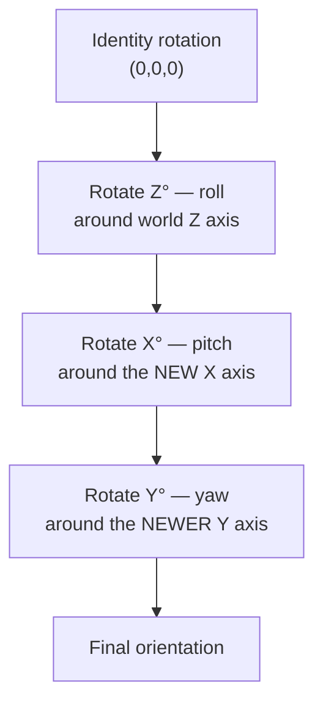
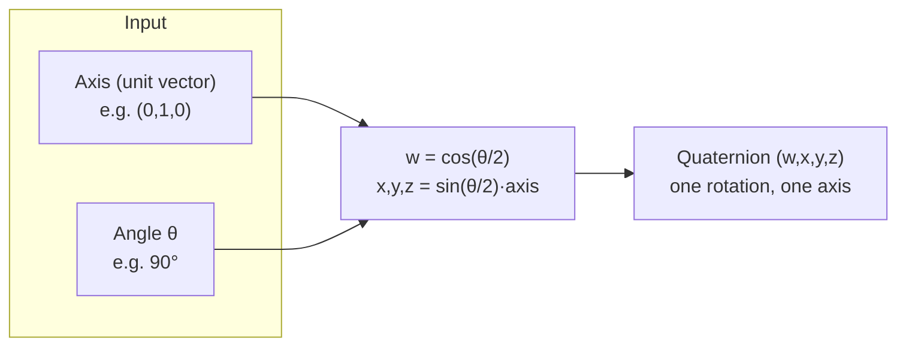

[Look here!!](https://medium.com/@dmdinithipurna/understanding-quaternions-67cf263c276f)

# Quaternions vs Euler angles (Unity & gamedev)

> [!summary] TL;DR
> 
> - **Euler angles** = 3 numbers (X, Y, Z), applied as 3 _sequential_ single-axis rotations. Human-readable, but breaks down: **gimbal lock**, order-dependence, bad interpolation, non-unique representation.
> - **Quaternions** = 1 number with 4 components (`w,x,y,z`) encoding a _single_ rotation around a _single_ axis. Not human-readable, but immune to gimbal lock, composes with one multiply, interpolates smoothly (`Slerp`).
> - Unity stores **every** rotation internally as a Quaternion. The Inspector shows Euler angles purely as a friendly _editing_ view — converted to/from Quaternion under the hood.
> - Rule of thumb: **write rotation code with `Quaternion`**, only touch `eulerAngles` for reading/display or genuinely single-axis cases (2D games, a spinning coin, a top-down turret).

---
	
## 1. Euler angles — what they actually are

An Euler angle rotation is **three separate rotations, applied one after another**, each around a single axis.



> [!important] Unity's specific order Unity applies Euler rotations in **Z, then X, then Y** order — confirmed in the official docs for both `Quaternion.Euler` and `Transform.eulerAngles`: rotations are performed around the Z axis, then the X axis, then the Y axis. This is an **intrinsic** rotation order — each axis is the object's _own_, already-rotated axis at that point, not the original world axis.

### Why order matters (non-commutativity)

Rotating Z→X→Y does **not** give the same final orientation as rotating X→Y→Z with the same three angle values. Rotations don't commute — this is the same reason you can't just "add" three Euler triples together and expect a sane result. If you've ever composed two rotations by rewriting them as Euler angles and adding component-wise, this is why it looked wrong.

### Non-uniqueness

Because rotation order is baked in, more than one (X,Y,Z) triple can represent the _same final orientation_. This is also why, in Unity specifically, reading `transform.eulerAngles` back after you set it can hand you completely different numbers than what you put in — same rotation, different valid representation.

---

## 2. Gimbal lock — the core failure mode

Picture three nested mechanical rings (**gimbals**), each free to spin only on its own axis — this is literally where the name comes from (ship/aircraft gyroscopes). Normally the three rings' spin axes are all pointing in different directions, giving you 3 independent degrees of freedom (DOF).

**Gimbal lock**: when the _middle_ rotation reaches 90°, the inner and outer rings' spin axes swing around until they point in the **same direction**. You've collapsed from 3 independent axes to 2 — an entire degree of freedom is gone until you rotate back out of that configuration.

```
NORMAL ORIENTATION                    GIMBAL LOCK (pitch = 90°)
                                       
        Yaw (Y)                              Yaw (Y) & Roll (Z)
           ↑                                       ↑ ↗
           |                                       |↗
           •  ← gimbal center                      • ───→ Pitch (X)
          ╱ ╲
         ╱   ╲
   Roll(Z)  Pitch(X)

3 independent rotation axes           Yaw and roll now spin around
                                       the exact same axis — 1 DOF lost
```

> [!warning] Why this actually bites you At pitch = 90°, moving the "yaw" slider and moving the "roll" slider do the **same thing** to the object. This isn't a display quirk — the rotation _math_ genuinely has only 2 usable degrees of freedom at that pose. It shows up as a camera or character suddenly "sticking" or spinning unpredictably when looking straight up/down.

### The other two Euler problems (beyond gimbal lock)

|Problem|What happens|
|---|---|
|**Bad interpolation**|Lerping/interpolating X, Y, Z independently doesn't trace the shortest 3D rotational path at constant speed — you can get wobble, or the "long way around"|
|**Order dependence**|Same 3 angle values, different rotation order (ZXY vs XYZ vs YXZ...) → different final orientation|
|**Non-uniqueness**|Multiple valid (X,Y,Z) triples can represent the identical final orientation|

---

## 3. Quaternions — what they are

A quaternion is a single 4-dimensional number, an extension of complex numbers:

```
q = w + xi + yj + zk
where  i² = j² = k² = ijk = -1
```

For a **unit quaternion** (length 1 — this is what all rotations use), the 4 components have a clean geometric meaning: a rotation of **θ degrees around a single axis**, packed as:

```
w         = cos(θ/2)
(x, y, z) = sin(θ/2) · axis        (axis = unit vector)
```



This is the whole trick: it's **one** rotation around **one** axis — not three chained single-axis rotations. There is no intermediate step where an axis can swing around and collide with another, so gimbal lock — which is a symptom of _decomposing_ a rotation into 3 sequential steps — simply can't occur, because quaternions never decompose it that way.

### Rotating a vector with a quaternion

```
v' = q · v · q⁻¹
```

(`v` is treated as a quaternion with `w=0`). You'll basically never need to hand-write this in Unity — `Quaternion * Vector3` does it for you — but it's worth knowing this is a single closed-form operation, not a 3-step process.

### Composing rotations

```
q_combined = q2 * q1     // apply q1 first, then q2
```

One multiplication, associative, no "which order were my angles applied in" bookkeeping.

### Interpolating rotations

`Quaternion.Slerp` (**s**pherical **l**inear int**erp**olation) walks the _shortest arc_ on the 4D unit hypersphere at **constant angular speed**. This is why Slerp looks smooth and Euler-angle lerping doesn't.

- `Quaternion.Slerp` — accurate constant-speed interpolation, more expensive
- `Quaternion.Lerp` — cheaper linear interpolation + renormalize (a.k.a. "nlerp"), a good approximation for short steps (e.g. per-frame rotation smoothing, networked rotation sync)

---

## 4. So why do Euler angles still exist / show up everywhere?

Because **humans can't intuit 4 numbers**. Nobody can look at `(0.5, 0.5, 0.5, 0.5)` and picture the orientation. Three angles — "30° up, 45° left, 10° tilt" — map directly onto how people think about turning something.

Unity's Manual is explicit about this trade-off: Euler angles have a simpler, more intuitive human-readable representation, while quaternions avoid gimbal lock — and Unity's answer is to use **both**: store the rotation internally as a Quaternion, but show/edit it as Euler angles in the Inspector, silently converting between the two.

> [!tip] When plain Euler angles are actually fine If you are rotating around **one axis only** — a 2D top-down game, a spinning coin/wheel, a turret that only yaws — there is no second or third rotation to collide with, so gimbal lock cannot happen. Plain `transform.Rotate(0, 0, angle)` style code is completely fine there. The problems only start once you need to compose rotations across 2+ axes.

---

## 5. Unity API cheat sheet

|Task|API|
|---|---|
|Build a rotation from angles|`Quaternion.Euler(x, y, z)`|
|Read a rotation as angles (display only)|`transform.eulerAngles` / `transform.localEulerAngles`|
|Face a direction|`Quaternion.LookRotation(forwardDir, upDir)`|
|Rotate from A to B smoothly|`Quaternion.Slerp(a, b, t)`|
|Cheap per-frame smoothing|`Quaternion.Lerp(a, b, t)` (renormalizes automatically)|
|No rotation|`Quaternion.identity`|
|Rotation between two directions|`Quaternion.FromToRotation(from, to)`|
|Decompose to axis + angle|`q.ToAngleAxis(out angle, out axis)`|
|Combine two rotations|`q2 * q1` (applies `q1` first, then `q2`)|
|Rotate a vector|`q * vector`|

### The classic footgun: incrementing `transform.eulerAngles`

```csharp
// DON'T do this — looks fine, breaks eventually
transform.eulerAngles += new Vector3(0, speed * Time.deltaTime, 0);
```

Because Euler representation isn't unique, **reading back `eulerAngles` after setting it can hand you a different-but-equivalent triple than what you wrote**. Unity's own docs warn about this directly: when reading the eulerAngles property, because there's more than one way to represent a given rotation with Euler angles, the values you read back may be quite different from the values you assigned — so incrementing based on the read-back value can drift or snap unexpectedly.

```csharp
// DO this instead — track your own float, only convert to Quaternion when applying
float yaw;
void Update()
{
    yaw += speed * Time.deltaTime;
    transform.rotation = Quaternion.Euler(0, yaw, 0);
}
```

### Floating-point drift

Quaternions must stay **unit length** to represent a valid rotation. Accumulating many small multiplications (character controllers, physics, networked rotation sync over many frames) can drift the length slightly due to float precision. `Quaternion.Lerp`/`Slerp` renormalize for you; if you're hand-multiplying quaternions repeatedly (e.g. custom IK, or accumulating sensor data for AR/VR orientation tracking), periodically call `.normalized` or renormalize manually.

### Relevant to networked / multiplayer rotation sync

For a networked object's rotation (paddle, player, ball spin), sending 4 floats (quaternion) per update is the standard approach — cheaper to interpolate correctly than 3 Euler floats, and `Quaternion.Lerp` (nlerp) is usually good enough frame-to-frame at typical network tick rates, reserving the pricier `Slerp` for larger corrective jumps.

---

## 6. Quick comparison table

||Euler angles|Quaternion|
|---|---|---|
|Representation|3 floats (X,Y,Z)|4 floats (w,x,y,z)|
|Human-readable|Yes|No|
|Gimbal lock|**Yes** (at 90° on middle axis)|No|
|Composable with 1 op|No (order-dependent chain)|Yes (`q2 * q1`)|
|Smooth interpolation|No (component-wise, uneven)|Yes (`Slerp`, constant angular speed)|
|Unique representation|No (multiple triples, same result)|Yes, up to sign (`q` and `-q` are the same rotation)|
|Unity storage|Editing/display only|**Internal storage for every Transform**|
|Good use case|Single-axis rotation, human input/display|Any multi-axis or accumulated/interpolated rotation|

---

## Related

- Unity Transform / MonoBehaviour internals
- C++/C# engine bridge notes
- Physics & collision system notes

## Sources

- [Unity Manual — Rotation and Orientation in Unity](https://docs.unity3d.com/6000.1/Documentation/Manual/QuaternionAndEulerRotationsInUnity.html)
- [Unity Scripting API — Quaternion.Euler](https://docs.unity3d.com/ScriptReference/Quaternion.Euler.html)
- [Unity Scripting API — Quaternion.eulerAngles](https://docs.unity3d.com/ScriptReference/Quaternion-eulerAngles.html)